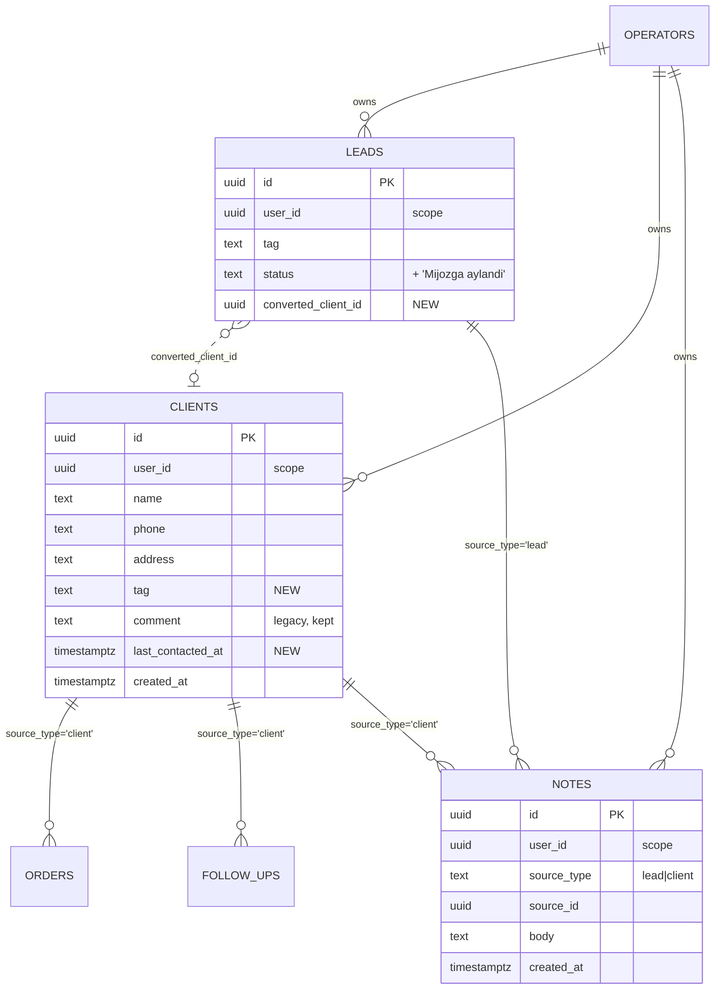
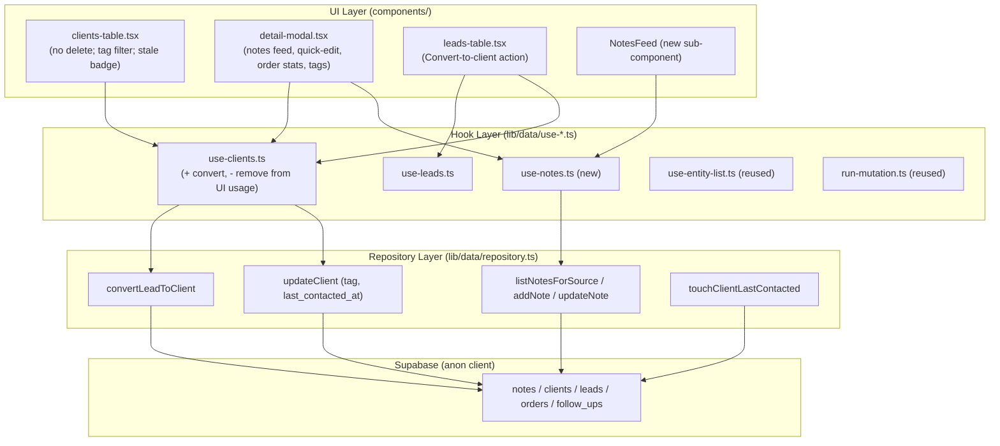

# Design Document: Client Management Enhancements

## Overview

This feature reorganizes and enriches **client** management in Sellora Plus CRM, taking
[amoCRM](https://www.amocrm.com/) as UX inspiration. It turns the client record from a flat
row with a single overwrite `comment` field into a richer, contact-centric workspace: a
timestamped **notes/activity timeline**, **tags/segments**, **inline quick-edit**, a
**last-contacted / stale indicator**, **order statistics**, and a one-click **lead → client
conversion**. It also **removes client deletion from the UI** (clients become non-destructive,
amoCRM-style historical records).

The work builds strictly on the infrastructure already merged in the `frontend-ux-improvements`
spec: the typed data-access layer (`lib/data/repository.ts` with `SCOPE_COLUMN = "user_id"`,
`Result<T>`, `useEntityList`, `runMutation`, per-entity hooks), the toast system
(`components/ui/use-toast`), and the async-state convention (`components/shared/async-content.tsx`).
All new data access flows **through `lib/data`** — no inline `supabase.from(...)` in components.

Unlike the previous frontend-only spec, this spec **introduces additive backend migrations**: a
new generic `notes` table and new additive columns on `clients` (and a small additive change to
`leads` for conversion). Migrations mirror the existing 002/003 access conventions (anon GRANT,
RLS disabled, `updated_at` trigger). **RLS hardening is explicitly out of scope** and tracked
separately; the new objects are made **no less safe than the existing tables** (identical posture),
never weaker.

### Goals

1. Remove the client delete affordance from the UI (no destructive DB delete required).
2. Add an amoCRM-style **notes timeline** (multiple timestamped notes) per client — designed
   generically so leads can share it (`source_type` / `source_id`).
3. One-click **Convert lead → client**, carrying over notes and linking the records.
4. **Tags/segments** for clients, consistent with how lead tags work today.
5. **Quick-edit** of client name/phone/address inline from the detail modal.
6. **Last-contacted + stale indicator** in the clients table, mirroring the leads "cold" banner.
7. **Order stats** (count + total + last order date) surfaced in the client detail modal.

### Non-Goals

- RLS / multi-tenant hardening of the database (tracked separately; we mirror the current posture).
- Changing the auth/session model or the operator-scoping mechanism.
- Migrating `leads.comment` away (kept for backward compatibility; new activity goes to the timeline).
- Bulk operations, note editing history/audit, or rich-text/attachment notes (future work).

---

# Part A — High-Level Design

## A.1 Data Model

### Existing (unchanged shape, relevant fields)

- **leads** `(id, user_id, operator_id, name, phone, address, tag, status, comment, created_at, updated_at)`
- **clients** `(id, user_id, operator_id, name, phone, address, comment, created_at, updated_at)`
- **orders** `(id, user_id, source_type, source_id, source_name, product, price, quantity, order_type, scheduled_at, comment, created_at, updated_at)`
- **follow_ups** `(id, user_id, source_type, source_id, source_name, source_phone, scheduled_at, note, status, created_at, updated_at)`

> Scoping convention (must be preserved): every read filters by `SCOPE_COLUMN = "user_id"`, and
> writes set **both** `user_id` and `operator_id` to the operator id (see `insertClient`/`insertOrder`).
> The value placed in `user_id` is the **operators.id**, not an `auth.users.id`.

### New table: `notes` (generic activity timeline)

A single generic table serves both clients and leads via the same `source_type` / `source_id`
polymorphic pattern already used by `orders` and `follow_ups`.

| Column        | Type          | Notes                                                        |
| ------------- | ------------- | ------------------------------------------------------------ |
| `id`          | UUID PK       | `gen_random_uuid()`                                          |
| `user_id`     | UUID NOT NULL | Operator scope column (mirrors existing tables)              |
| `operator_id` | UUID          | Mirror of `user_id` (matches 003 pattern; set on insert)     |
| `source_type` | TEXT NOT NULL | `CHECK (source_type IN ('lead','client'))`                   |
| `source_id`   | UUID NOT NULL | Id of the owning lead/client                                 |
| `body`        | TEXT NOT NULL | The note content                                             |
| `created_at`  | TIMESTAMPTZ   | `DEFAULT NOW()`                                              |
| `updated_at`  | TIMESTAMPTZ   | `DEFAULT NOW()`, maintained by `update_updated_at()` trigger |

### New columns

- **clients.tag** `TEXT` (nullable) — mirrors `leads.tag`; free-text/preset segment.
- **clients.last_contacted_at** `TIMESTAMPTZ` (nullable) — denormalized "last interaction"
  timestamp, updated whenever a note/order/follow-up is created for the client. Nullable so
  existing rows need no backfill; the staleness helper treats `null` as "use `created_at`".
- **leads.converted_client_id** `UUID` (nullable) — set when a lead is converted; links the
  historical lead to the created client.
- **leads.status** CHECK extended to add `'Mijozga aylandi'` ("converted to client") so a
  converted lead is removed from the active/cold pipeline and clearly labeled.

### Entity-Relationship (new objects highlighted)



## A.2 Architecture & Module Boundaries

The layered architecture from the prior spec is preserved. New responsibilities slot into the
existing layers; **no component talks to Supabase directly**.



**Boundaries**

- **Repository** (`lib/data/repository.ts`): the only place that calls `supabase.from(...)`,
  applies `SCOPE_COLUMN`, and maps `{data,error}` → `Result<T>`. New functions:
  `listNotesForSource`, `addNote`, `updateNote`, `convertLeadToClient`,
  `touchClientLastContacted`; extended `ClientInput` (tag) and `updateClient`.
- **Hooks** (`lib/data/use-*.ts`): own React state, operator scoping, toasts via
  `useEntityList` + `runMutation`. New `use-notes.ts`; `use-clients.ts` gains `convert`.
- **Components**: presentational; consume hooks. `clients-table.tsx` drops all delete code;
  `detail-modal.tsx` gains the notes feed, quick-edit, tags, and richer order stats; a small
  reusable `NotesFeed` lives under `components/shared/`.

## A.3 Key Flows

### Add note (timeline)

```mermaid
sequenceDiagram
    participant U as Operator
    participant DM as PersonDetailModal
    participant UN as useNotes
    participant R as repository
    participant DB as Supabase

    U->>DM: type note + submit
    DM->>UN: addNote(body)
    UN->>R: addNote(operatorId, {source_type, source_id, body})
    R->>DB: insert notes (+ user_id, operator_id)
    DB-->>R: { data: note }
    R-->>UN: ok(note)
    UN->>R: touchClientLastContacted(source_id)  %% only for clients
    UN-->>DM: prepend note (optimistic apply) + success toast
    DM-->>U: reverse-chronological feed updates; input clears
```

### Convert lead → client

```mermaid
sequenceDiagram
    participant U as Operator
    participant LT as leads-table / detail-modal
    participant UC as useClients
    participant R as repository
    participant DB as Supabase

    U->>LT: click "Mijozga aylantirish"
    LT->>UC: convert(lead)
    UC->>R: convertLeadToClient(operatorId, lead)
    R->>DB: insert clients {name, phone, address, comment, tag}
    DB-->>R: { data: client }
    R->>DB: update notes set source_type='client', source_id=client.id where source='lead'/lead.id
    R->>DB: update leads set status='Mijozga aylandi', converted_client_id=client.id
    R-->>UC: ok(client)
    UC-->>LT: success toast; refetch leads & clients
    LT-->>U: lead shown as "Mijozga aylandi"; new client available
```

---

# Part B — Low-Level Design

## B.1 Migrations

### `supabase/migrations/007_notes.sql`

```sql
-- =============================================
-- 007: Notes / activity timeline (generic, lead + client)
-- Mirrors the access posture of 002/003: RLS disabled, anon GRANT,
-- updated_at trigger. RLS hardening tracked separately (out of scope).
-- =============================================

CREATE TABLE IF NOT EXISTS notes (
  id           UUID DEFAULT gen_random_uuid() PRIMARY KEY,
  user_id      UUID NOT NULL,                 -- operator scope (SCOPE_COLUMN), matches existing tables
  operator_id  UUID,                          -- mirror of user_id (003 convention)
  source_type  TEXT NOT NULL CHECK (source_type IN ('lead', 'client')),
  source_id    UUID NOT NULL,
  body         TEXT NOT NULL,
  created_at   TIMESTAMPTZ DEFAULT NOW() NOT NULL,
  updated_at   TIMESTAMPTZ DEFAULT NOW() NOT NULL
);

-- Access posture identical to existing data tables (see 002_disable_rls.sql).
ALTER TABLE notes DISABLE ROW LEVEL SECURITY;
GRANT ALL ON notes TO anon;

-- Indexes mirror orders' source/scope indexes.
CREATE INDEX IF NOT EXISTS idx_notes_user_id  ON notes(user_id);
CREATE INDEX IF NOT EXISTS idx_notes_source   ON notes(source_id, source_type);
CREATE INDEX IF NOT EXISTS idx_notes_created  ON notes(created_at);

-- Reuse the shared trigger function from 001_initial.sql.
CREATE TRIGGER notes_updated_at BEFORE UPDATE ON notes
  FOR EACH ROW EXECUTE FUNCTION update_updated_at();
```

> **Design note on the `user_id` FK:** the original `001_initial.sql` declared
> `user_id ... REFERENCES auth.users(id)`, but the running app stores the **operator id**
> (from `operators`) in `user_id`. The new `notes.user_id` therefore intentionally has **no
> `auth.users` foreign key**, so inserts keep working under the current operator-scoping model.
> This keeps `notes` exactly as safe as the existing tables (anon GRANT + RLS disabled) and no
> weaker. Hardening of the whole scoping/RLS model is tracked separately.

### `supabase/migrations/008_client_enrichment.sql`

```sql
-- =============================================
-- 008: Client enrichment (tags, last-contacted) + lead conversion link
-- All changes are additive and backward-compatible.
-- =============================================

-- 1. Client tags (mirrors leads.tag)
ALTER TABLE clients ADD COLUMN IF NOT EXISTS tag TEXT;
CREATE INDEX IF NOT EXISTS idx_clients_tag ON clients(tag);

-- 2. Client last-contacted timestamp (nullable; null => fall back to created_at in UI)
ALTER TABLE clients ADD COLUMN IF NOT EXISTS last_contacted_at TIMESTAMPTZ;
CREATE INDEX IF NOT EXISTS idx_clients_last_contacted ON clients(last_contacted_at);

-- 3. Lead -> client conversion link
ALTER TABLE leads ADD COLUMN IF NOT EXISTS converted_client_id UUID;

-- 4. Extend the lead status CHECK to include the converted state.
ALTER TABLE leads DROP CONSTRAINT IF EXISTS leads_status_check;
ALTER TABLE leads ADD CONSTRAINT leads_status_check
  CHECK (status IN ('Yangi', 'Ko''rib chiqilmoqda', 'Kelishildi',
                    'Rad etildi', 'Buyurtma berilgan', 'Mijozga aylandi'));
```

## B.2 Types (`types/index.ts`)

```typescript
// New domain types
export interface Note {
  id: string;
  user_id: string;
  source_type: SourceType;   // "lead" | "client"
  source_id: string;
  body: string;
  created_at: string;
  updated_at: string;
}

// Extended existing interfaces (additive fields)
export interface Client {
  id: string;
  user_id: string;
  name: string;
  phone: string;
  address: string | null;
  tag: string | null;             // NEW
  comment: string | null;         // legacy, kept for backward-compat
  last_contacted_at: string | null; // NEW
  created_at: string;
  updated_at: string;
}

export interface Lead {
  // ...existing fields...
  status: LeadStatus;
  converted_client_id: string | null; // NEW
}

export type LeadStatus =
  | "Yangi"
  | "Ko'rib chiqilmoqda"
  | "Kelishildi"
  | "Rad etildi"
  | "Buyurtma berilgan"
  | "Mijozga aylandi";              // NEW

// Reuse DEFAULT_TAGS for clients too (no new constant needed).
```

## B.3 Repository signatures (`lib/data/repository.ts`)

```typescript
// ---- Input shapes ----
export interface ClientInput {
  name: string;
  phone: string;
  address: string | null;
  tag: string | null;        // NEW
  comment: string | null;
}

export interface NoteInput {
  source_type: SourceType;
  source_id: string;
  body: string;
}

// ---- Notes reads/writes (every read applies .eq(SCOPE_COLUMN, operatorId)) ----
export async function listNotesForSource(
  operatorId: string,
  sourceId: string,
  sourceType: SourceType
): Promise<Result<Note[]>>;   // ordered created_at DESC (reverse-chronological)

export async function addNote(
  operatorId: string,
  input: NoteInput
): Promise<Result<Note>>;      // inserts { user_id, operator_id, ...input }

export async function updateNote(
  id: string,
  body: string
): Promise<Result<Note>>;

// ---- Client enrichment writes ----
// updateClient already exists; ClientInput now carries `tag`, so partial updates of
// tag / last_contacted are supported. A focused helper keeps the "touch" intent explicit:
export async function touchClientLastContacted(
  id: string,
  whenISO?: string            // defaults to new Date().toISOString()
): Promise<Result<Client>>;

// ---- Lead -> client conversion (multi-step, operator-scoped) ----
export async function convertLeadToClient(
  operatorId: string,
  lead: Lead
): Promise<Result<Client>>;
```

### `convertLeadToClient` behavior (decision record)

- **Create** a client from `lead.name / phone / address / comment / tag`, scoped to the operator.
- **Re-point notes**: `UPDATE notes SET source_type='client', source_id=<clientId>` where the
  notes currently belong to the lead (`source_type='lead' AND source_id=lead.id`). Notes are
  generic, so re-pointing preserves the full timeline without copying. (Orders/follow-ups are
  **not** re-pointed in this iteration — they remain attached to the lead as historical record;
  this is called out as a future enhancement.)
- **The lead remains** as a historical/audit record: `status = 'Mijozga aylandi'` and
  `converted_client_id = <clientId>`. The new `'Mijozga aylandi'` status places it outside the
  active/cold pipeline (see `CLOSED_LEAD_STATUSES` update below).
- Sets the new client's `last_contacted_at = now()`.
- Best-effort sequencing: if the client insert fails, return the error and make no further
  changes. The note re-point and lead update follow only after a successful insert. (Supabase
  has no client-side transaction here; failures after insert surface via toast and are
  idempotent on retry because conversion keys off `converted_client_id`.)

## B.4 Hook changes

### New: `lib/data/use-notes.ts`

```typescript
export interface UseNotesResult {
  notes: Note[];
  loading: boolean;
  error: string | null;
  reload: () => Promise<void>;
  addNote: (body: string) => Promise<boolean>;     // false on validation/empty or error
}

// Loads notes for (sourceId, sourceType) on mount/id change; addNote prepends optimistically
// via runMutation, shows one toast, and for clients also calls touchClientLastContacted.
export function useNotes(sourceId: string, sourceType: SourceType): UseNotesResult;
```

### `lib/data/use-clients.ts`

```typescript
export interface UseClientsResult extends EntityListState<Client> {
  // remove() stays for non-UI/back-compat callers but is NOT wired to any clients UI control.
  remove: (id: string) => Promise<void>;
  loadClientOrders: (clientId: string) => Promise<Order[]>;
  convert: (lead: Lead) => Promise<Client | null>; // NEW: wraps convertLeadToClient via runMutation
}
```

### `lib/data/use-leads.ts`

- After a successful conversion the leads list must refetch (so the lead shows
  `'Mijozga aylandi'`). The convert action lives where the lead context is available
  (leads-table / lead detail modal) and calls `useClients().convert(lead)` then `useLeads().refetch()`.

## B.5 Component changes

### `components/clients/clients-table.tsx`

- **Remove** the destructive delete UI: drop the `AlertDialog` block, the `Trash2` button,
  `deletingId` state, `handleDelete`, and the `remove` usage from `useClients()`. (The `remove`
  capability and generic `deleteRow` stay in the data layer for other entities; clients are
  simply not deletable from the UI.)
- **Tag column + filter**: add a tag chip column (mirroring leads) and a tag `Select` filter
  seeded from `DEFAULT_TAGS` plus any tags present in the loaded clients.
- **Stale indicator**: add a "needs attention" banner + per-row badge using a new pure helper
  `getClientStaleness(client)` (see B.6), mirroring the leads "7+ kun bog'lanilmagan" banner.
- The `ClientFormModal` add/edit form gains a **tag** `Select`.

### `components/shared/detail-modal.tsx` (`PersonDetailModal`)

- **Notes feed**: render a reverse-chronological `NotesFeed` (new shared sub-component) backed
  by `useNotes(person.id, sourceType)`, with an "add note" input above it. Uses `AsyncContent`
  for loading/error/empty branches and `useToast` for feedback.
- **Quick-edit**: an edit affordance toggles inline editing of `name / phone / address`
  (and `tag` for clients), saving via `updateClient` + toast without closing the modal; on
  success calls `onRefresh`.
- **Order stats**: extend the header/orders section to show **count + total (`getOrderTotal`) +
  last order date** (most recent `orders[0].created_at`, since orders load DESC). Total already
  computed; add the "last order" line.
- **Backward-compat comment**: keep showing the legacy `person.comment` (read-only) above the
  timeline; new activity goes to notes.

### `components/leads/leads-table.tsx` (and/or lead branch of detail modal)

- Add a **"Mijozga aylantirish"** (Convert to client) row action / detail button that calls the
  convert flow, then refetches. Disabled when `lead.status === 'Mijozga aylandi'` /
  `converted_client_id` is set.

## B.6 Pure helpers (`lib/utils.ts`)

```typescript
export interface ClientStaleness {
  days: number;          // days since last contact (or created_at if last_contacted_at is null)
  stale: boolean;        // days >= STALE_DAYS
  label: string;         // e.g. "N kun aloqasiz"
  color: string;         // Tailwind classes, mirrors getLeadAge buckets
}

export const CLIENT_STALE_DAYS = 7;

/** Reference date param keeps the function pure/testable (no hidden Date.now()). */
export function getClientStaleness(
  client: Pick<Client, "last_contacted_at" | "created_at">,
  now?: number
): ClientStaleness;

// Converted leads leave the active/cold pipeline:
const CLOSED_LEAD_STATUSES = ["Buyurtma berilgan", "Rad etildi", "Mijozga aylandi"];
```

## B.7 Pseudocode

### Add note

```pascal
PROCEDURE addNote(operatorId, sourceType, sourceId, body)
  trimmed <- trim(body)
  IF trimmed = "" THEN RETURN false            // validation: reject empty/whitespace
  result <- repository.addNote(operatorId, { sourceType, sourceId, body: trimmed })
  IF NOT result.ok THEN
    toast.error(result.error); RETURN false
  prepend result.data TO notes                  // reverse-chronological, newest first
  IF sourceType = "client" THEN
    repository.touchClientLastContacted(sourceId)  // best-effort
  toast.success("Eslatma qo'shildi")
  RETURN true
END
```

### Convert lead to client

```pascal
PROCEDURE convertLeadToClient(operatorId, lead)
  IF lead.converted_client_id <> NULL THEN
    RETURN ok(existing client)                  // idempotent guard
  client <- INSERT clients {
      user_id: operatorId, operator_id: operatorId,
      name: lead.name, phone: lead.phone, address: lead.address,
      tag: lead.tag, comment: lead.comment,
      last_contacted_at: now()
  }
  IF insert failed THEN RETURN err(...)
  UPDATE notes
     SET source_type = "client", source_id = client.id
   WHERE user_id = operatorId
     AND source_type = "lead" AND source_id = lead.id
  UPDATE leads
     SET status = "Mijozga aylandi", converted_client_id = client.id
   WHERE id = lead.id
  RETURN ok(client)
END
```

### Client staleness

```pascal
FUNCTION getClientStaleness(client, now)
  reference <- client.last_contacted_at OR client.created_at
  days <- floor((now - reference) / MS_PER_DAY)
  stale <- days >= CLIENT_STALE_DAYS
  label <- IF stale THEN days + " kun aloqasiz" ELSE "Faol"
  color <- bucketColor(days)                    // reuse getLeadAge bucket thresholds
  RETURN { days, stale, label, color }
END
```

---

## Correctness Properties

*A property is a characteristic or behavior that should hold true across all valid executions of
the system — a formal statement about what the system should do. Requirement references below are
provisional and will be finalized against `requirements.md` in the requirements phase.*

### Property 1: Notes feed is reverse-chronological

*For any* set of notes belonging to a source, the rendered timeline orders them strictly by
`created_at` descending (newest first).

### Property 2: Empty/whitespace notes are rejected

*For any* string consisting solely of whitespace, `addNote` rejects it and the notes list is
unchanged (no insert occurs).

### Property 3: Adding a note grows the timeline by exactly one

*For any* existing notes list and any non-empty note body, a successful `addNote` results in a
list whose length increased by one and which contains the new note.

### Property 4: Conversion re-points the full timeline

*For any* lead with N notes, after `convertLeadToClient` the created client's timeline contains
exactly those N notes (re-pointed, none lost or duplicated) and the lead has zero remaining notes.

### Property 5: Conversion is idempotent

*For any* lead already converted (`converted_client_id` set), invoking conversion again does not
create a second client and does not duplicate notes.

### Property 6: Converted leads leave the active pipeline

*For any* lead with status `'Mijozga aylandi'`, the cold/age filters exclude it (it is treated as
a closed status, like `'Buyurtma berilgan'` / `'Rad etildi'`).

### Property 7: Client staleness threshold

*For any* client, `getClientStaleness` reports `stale = true` if and only if the number of whole
days since the effective last-contact timestamp (or `created_at` when null) is at least
`CLIENT_STALE_DAYS`.

### Property 8: Clients are not deletable from the UI

*For any* rendering of the clients table, no control invokes client deletion (`remove` /
`deleteRow("clients", ...)`), and the destructive AlertDialog is absent.

### Property 9: Tag filter soundness

*For any* tag filter value other than "all", every client shown by the clients table has a `tag`
equal to the selected value.

### Property 10: Order stats consistency

*For any* set of a client's orders, the detail modal's displayed total equals
`getOrderTotal(orders)`, the displayed count equals `orders.length`, and the "last order" date
equals the maximum `created_at` among those orders (or absent when there are none).

### Property 11: Quick-edit persists through the repository

*For any* valid edit of a client's name/phone/address/tag from the detail modal, the values
saved go through `updateClient` (operator-scoped) and the refreshed client reflects exactly the
submitted values.

### Property 12: Reads stay operator-scoped

*For any* operator and any notes query, every returned note has `user_id` equal to that operator
(the read applies `.eq(SCOPE_COLUMN, operatorId)`).

---

## Error Handling

| Scenario | Response | Recovery |
| --- | --- | --- |
| Notes load fails | `AsyncContent` error branch + error toast | Retry button re-runs the load |
| `addNote` insert fails | Error toast; list untouched; input retains text | User can re-submit |
| `convertLeadToClient` client insert fails | Error toast; no notes/lead mutation performed | Retry; idempotent via `converted_client_id` |
| `touchClientLastContacted` fails | Silent (best-effort); note still added | Next interaction re-touches |
| `updateClient` (quick-edit) fails | Error toast; modal stays open with entered values | User re-saves |
| Empty/whitespace note body | Rejected client-side before any call | Inline disabled submit / no-op |

All repository calls return `Result<T>`; hooks surface failures through exactly one toast via
`runMutation`, never silently.

## Testing Strategy

Tooling already configured in the repo: **Vitest** (unit/property runner), **fast-check**
(property-based testing), and **React Testing Library** (component behavior). Minimum **100
iterations** per property test; each property test is tagged
`Feature: client-management-enhancements, Property N: <text>`.

### Unit tests (examples & edge cases)

- `getClientStaleness`: boundary at exactly `CLIENT_STALE_DAYS`; `last_contacted_at = null`
  falls back to `created_at`; future timestamps clamp to 0 days.
- `convertLeadToClient`: maps lead fields to client; sets status/link; re-point query shape.
- Repository scope: `addNote`/`listNotesForSource` set/filter `user_id`.

### Property-based tests (fast-check)

- **P1/P3** Notes ordering and growth: generate random note lists + bodies; assert DESC order
  and length+containment after add.
- **P2** Whitespace rejection: generate whitespace-only strings; assert no insert.
- **P4/P5** Conversion: generate a lead with N random notes; assert timeline re-point count and
  idempotency on a second conversion.
- **P6** Pipeline exclusion: generate leads across all statuses; assert `applyFilters` age filter
  excludes `'Mijozga aylandi'`.
- **P7** Staleness: generate timestamps around the threshold; assert `stale` iff `days >= 7`.
- **P9** Tag filter: generate clients with random tags; assert filtered rows all match.
- **P10** Order stats: generate random orders; assert total/count/last-date invariants.
- **P12** Scope: generate operator ids + notes; assert returned notes all carry the operator id.

### Component tests (RTL)

- **P8** Clients table renders no delete control and no AlertDialog.
- Detail modal: add-note input clears on submit; feed updates; quick-edit toggles and saves;
  order stats line renders count/total/last date.
- Convert action: disabled once `converted_client_id` is set; triggers refetch on success.

### Out of scope for automated tests

- Supabase/anon GRANT/RLS posture (infrastructure; verified manually via migration review).
- Exact dark-theme visual styling (Tailwind tokens) — covered by reuse of existing primitives.

---

## Dependencies

- **Existing app infrastructure** (reused, no new packages): typed repository + `Result<T>`,
  `useEntityList`, `runMutation`, `useOperator`, toast system, `AsyncContent`/`EmptyState`/
  `ErrorState`, `lib/utils` helpers, shadcn-style UI primitives (`Dialog`, `Input`, `Button`,
  `Select`, `Label`, `Textarea`).
- **Database**: new migrations `007_notes.sql` and `008_client_enrichment.sql` (additive).
- **Testing**: Vitest, fast-check, React Testing Library (already configured).
- **No new runtime libraries** are introduced.
