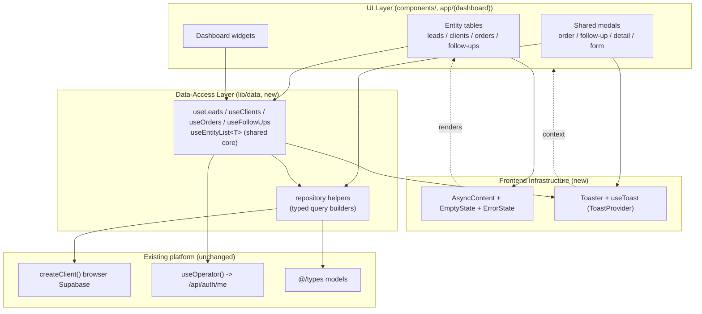
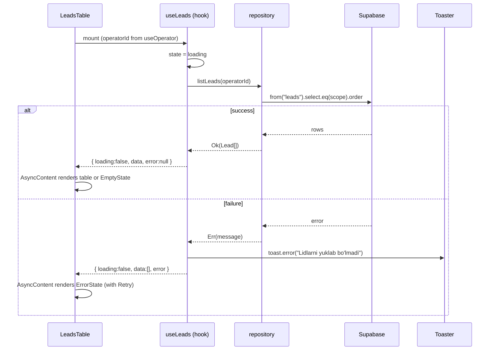
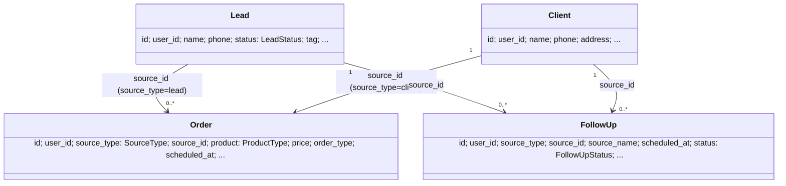
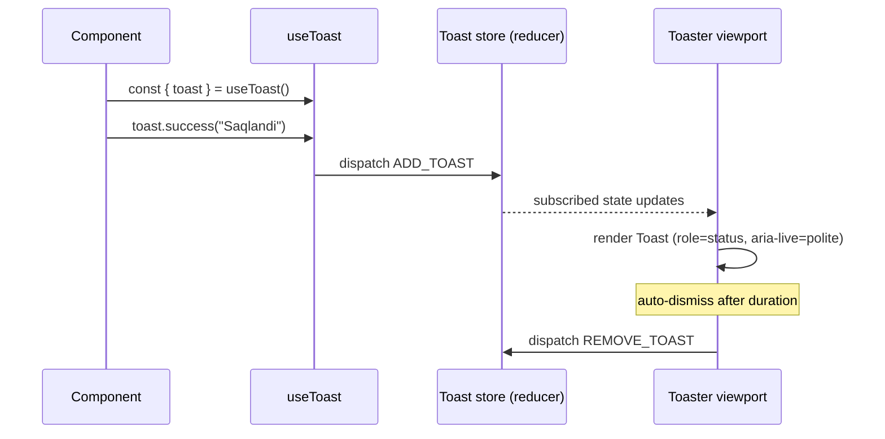

# Design Document: Frontend UX Improvements

## Overview

Sellora Plus CRM (`crm-system`) is a Next.js 16 App Router + Supabase application (TypeScript, Tailwind v4, shadcn/ui-style primitives under `components/ui`). Operators manage **leads**, **clients**, **orders**, and **follow-ups** from a dashboard, scoped to the server-verified operator identity from `useOperator()` (`/api/auth/me`).

A code review surfaced recurring frontend quality problems that degrade UX and maintainability: errors are shown through blocking `alert()` calls or silently swallowed by `console.error`; loading/empty/error states are implemented ad hoc and inconsistently (a failed load can leave the UI permanently on "Yuklanmoqda..." or on an empty "topilmadi" message with no explanation); `any` types leak through order/follow-up rendering; every table re-implements Supabase querying, operator-scoping, and duplicate-checking inline (and disagrees on the scoping column — `user_id` vs `operator_id`); list rows wrap sibling `<tr>` elements in an un-keyed Fragment (React key warnings); a stale `patch/` directory duplicates components; and successful create/update/delete actions give no positive confirmation.

This design introduces a small, cohesive **frontend infrastructure layer** — an accessible toast/notification system, a reusable async-state rendering convention with shared empty/error components, fully typed per-entity data-access hooks built on the existing browser Supabase client, and corrected React patterns — and applies it across the four entity tables, the shared modals, and the dashboard. **Scope is strictly frontend**: `components/`, `app/(dashboard)`, `lib/` client helpers, and `types/`. The backend/database authorization model (RLS, auth/session security) is explicitly **out of scope** and deferred to a separate backend-security spec. We reuse the existing `components/ui` primitives, Tailwind design tokens, `date-fns`, and `lucide-react`; no new heavy UI framework is introduced.

---

## High-Level Design

### Goals and Non-Goals

**Goals**
- One accessible, non-blocking notification mechanism (toasts) used for all error and success feedback.
- One consistent `{ loading, error, empty, data }` rendering convention with shared `EmptyState` / `ErrorState` components.
- A typed, centralized data-access layer (per-entity hooks) that removes inline Supabase duplication and surfaces failures to toasts.
- Elimination of `any` in data components; typed models for every row shape that is rendered.
- Correct React keying for Fragment-wrapped sibling rows.
- Consistent dialog focus management, disabled/loading button states, and success confirmations for CRUD.
- Removal of the stale `patch/` directory.

**Non-Goals**
- No changes to `supabase/migrations`, RLS policies, or the auth/session security model (`proxy.ts`, `lib/session.ts` signing/verification).
- No new authentication; continue using `operator.id` from `useOperator()`.
- No change to the database authorization model. Standardizing the *query* scoping column is a frontend consistency concern only and must not weaken row scoping (see "Operator-scoping consistency").
- No migration to a heavy component library (e.g., MUI). Toasts are built on existing primitives + Tailwind tokens.

### Architecture



The infrastructure layer sits between the existing UI and the existing Supabase/`useOperator` platform. Tables and widgets consume **typed hooks** for data and an **AsyncContent** convention for rendering; all components consume **useToast** for feedback. Nothing below the data-access layer (Supabase client, auth, DB) changes.

### Module Boundaries

| Module | Path | Responsibility |
| --- | --- | --- |
| Toast primitives | `components/ui/toast.tsx` | Presentational `Toast`, `ToastViewport` styled with Tailwind tokens + `lucide-react` icons. |
| Toast state + hook | `components/ui/use-toast.tsx` (or `lib/use-toast.ts`) | `ToastProvider`, `useToast()` returning `toast(...)`, reducer for the toast queue, auto-dismiss. |
| Toaster mount | `components/ui/toaster.tsx` | Subscribes to toast state and renders the viewport; mounted once in layouts. |
| Async rendering | `components/shared/async-content.tsx` | `AsyncContent`, `EmptyState`, `ErrorState` — the standard `{loading,error,empty}` convention. |
| Data-access core | `lib/data/use-entity-list.ts` | Generic `useEntityList<T>` (load, refetch, loading/error state, toast on error, operator scoping). |
| Entity hooks | `lib/data/use-leads.ts`, `use-clients.ts`, `use-orders.ts`, `use-follow-ups.ts` | Typed wrappers + entity-specific queries (duplicate check, lead-orders, confirm/markDone, deletes). |
| Repository | `lib/data/repository.ts` | Thin typed query builders over `createClient()` returning `Result<T>`; the single place the scoping column is applied. |
| Types | `types/index.ts` | Existing models reused; add `OrderRow` alias / narrow render types where `any` was used. |

> **Boundary rule:** UI components MUST NOT call `supabase.from(...)` directly. All reads/writes go through the data-access layer. Modals that currently call Supabase inline (`order-modal`, `follow-up-modal`, `clients` form, `leads` form) are refactored to call repository mutations and report results via `useToast`.

### Component / Data Flow



### Data Model

All rendered row shapes become typed. Existing `@/types` models (`Lead`, `Client`, `Order`, `FollowUp`, `SourceType`, etc.) are reused as-is; we only fill gaps where `any` was used and add small render/aggregate helpers.



**Operator-scoping consistency (frontend query only).** Today queries disagree: `leads`/`clients`/`follow_ups` filter by `user_id`, `orders-table` filters by `operator_id`, and `detail-modal` filters orders by `user_id`; inserts write **both** `user_id` and `operator_id`. The repository centralizes the scoping column in **one constant** (`SCOPE_COLUMN`) so all reads agree. Because inserts already populate both columns identically with `operator.id`, standardizing reads on a single column does not change which rows are visible. This is a consistency/maintainability fix, not an authorization change; DB-side enforcement remains deferred to the backend-security spec.

---

## Low-Level Design

Language: **TypeScript / React 19** (detected from the repo — Next.js 16, `.tsx`). All examples use the existing aliases (`@/components/ui/*`, `@/lib/*`, `@/types`).

### 1. Toast API



#### Types

```typescript
// components/ui/use-toast.tsx
export type ToastVariant = "default" | "success" | "error" | "warning";

export interface ToastOptions {
  title?: string;
  description?: string;
  variant?: ToastVariant;
  /** Auto-dismiss in ms; 0 = sticky (manual close). Default 4000. */
  duration?: number;
}

export interface ToastRecord extends Required<Pick<ToastOptions, "variant" | "duration">> {
  id: string;
  title?: string;
  description?: string;
  open: boolean;
}

export interface ToastApi {
  /** Generic toast; returns the toast id for programmatic dismissal. */
  show: (opts: ToastOptions) => string;
  success: (message: string, opts?: Omit<ToastOptions, "variant">) => string;
  error: (message: string, opts?: Omit<ToastOptions, "variant">) => string;
  warning: (message: string, opts?: Omit<ToastOptions, "variant">) => string;
  dismiss: (id?: string) => void; // no id => dismiss all
}
```

#### `useToast` hook + provider

```typescript
// Signatures
export function ToastProvider(props: { children: React.ReactNode }): JSX.Element;
export function useToast(): ToastApi;        // throws if used outside ToastProvider
export function Toaster(): JSX.Element;       // mounted once; reads context, renders viewport
```

#### Reducer pseudocode (no external state lib)

```pascal
STRUCTURE ToastState
  toasts: List<ToastRecord>   // newest first, capped at MAX_VISIBLE (e.g. 4)
END STRUCTURE

PROCEDURE reducer(state, action)
  CASE action.type OF
    "ADD":
      record ← action.toast WITH open = true
      RETURN { toasts: prepend(record, take(state.toasts, MAX_VISIBLE - 1)) }
    "DISMISS":               // start exit animation
      RETURN { toasts: map(state.toasts, t =>
                 (action.id = NULL OR t.id = action.id) ? t WITH open=false : t) }
    "REMOVE":                // after animation / duration
      RETURN { toasts: filter(state.toasts, t => t.id ≠ action.id) }
  END CASE
END PROCEDURE

PROCEDURE show(opts)         // inside provider
  id ← cryptoRandomId()
  duration ← opts.duration ?? 4000
  dispatch ADD { id, variant: opts.variant ?? "default", duration, title, description }
  IF duration > 0 THEN scheduleTimeout(duration, () => dispatch DISMISS id)
  RETURN id
END PROCEDURE
```

#### Accessibility & styling contract
- Viewport is a fixed-position container with `role="region"` and an `aria-live="polite"` (errors use `aria-live="assertive"`) live region so screen readers announce messages.
- Each toast: `role="status"`, a variant icon (`CheckCircle2`/`AlertCircle`/`AlertTriangle` from `lucide-react`), and a close button with `aria-label`.
- Colors reuse existing Tailwind tokens already present in `lib/utils.ts` conventions (e.g. `bg-emerald-500/10 text-emerald-400 border-emerald-500/30` for success, `bg-red-500/...` for error), matching `getStatusColor` palette. No new design tokens.
- Mounted once via `<Toaster />` in `app/(dashboard)/layout.tsx` (and the admin layout); `ToastProvider` wraps the dashboard tree.

> **Implementation note:** Built as a self-contained context + reducer to honor the "no heavy framework" guardrail. `@radix-ui/react-toast` is a viable drop-in (the project already depends on several `@radix-ui/*` packages) if richer swipe/focus behavior is wanted later; the `ToastApi` surface above is intentionally compatible so adoption would not change call sites.

### 2. Async-state rendering convention

A single declarative wrapper replaces the repeated `loading ? spinner : empty ? msg : table` ternaries and adds the missing **error** branch.

```typescript
// components/shared/async-content.tsx
export interface AsyncContentProps<T> {
  loading: boolean;
  error: string | null;
  data: T[];
  /** Render when data is non-empty. */
  children: (data: T[]) => React.ReactNode;
  empty?: { icon?: LucideIcon; title: string; description?: string; action?: React.ReactNode };
  /** Called by ErrorState's retry button. */
  onRetry?: () => void;
  /** Optional custom skeleton; defaults to centered spinner. */
  loadingFallback?: React.ReactNode;
}

export function AsyncContent<T>(props: AsyncContentProps<T>): JSX.Element;
export function EmptyState(props: { icon?: LucideIcon; title: string; description?: string; action?: React.ReactNode }): JSX.Element;
export function ErrorState(props: { message: string; onRetry?: () => void }): JSX.Element;
```

Decision precedence (deterministic, see Property 5):

```pascal
PROCEDURE AsyncContent(loading, error, data)
  IF loading THEN RETURN LoadingFallback        // spinner ("Yuklanmoqda...")
  IF error ≠ NULL THEN RETURN ErrorState(error, onRetry)
  IF isEmpty(data) THEN RETURN EmptyState(...)
  RETURN children(data)
END PROCEDURE
```

`ErrorState` shows the message + a "Qayta urinish" (retry) button wired to `onRetry` (the hook's `refetch`). This guarantees a failed load can never leave the UI stuck on the spinner or silently empty.

### 3. Data-access hooks

#### Result type and repository

```typescript
// lib/data/result.ts
export type Result<T> = { ok: true; data: T } | { ok: false; error: string };

// lib/data/repository.ts
const SCOPE_COLUMN = "user_id" as const; // single source of truth for operator scoping (reads)

export async function listLeads(operatorId: string): Promise<Result<Lead[]>>;
export async function listClients(operatorId: string): Promise<Result<Client[]>>;
export async function listOrders(operatorId: string): Promise<Result<Order[]>>;
export async function listFollowUps(operatorId: string): Promise<Result<FollowUp[]>>;
export async function listOrdersForSource(
  operatorId: string, sourceId: string, sourceType: SourceType
): Promise<Result<Order[]>>;

export async function insertLead(input: LeadInput): Promise<Result<Lead>>;
export async function updateLead(id: string, input: Partial<LeadInput>): Promise<Result<Lead>>;
export async function deleteRow(table: EntityTable, id: string): Promise<Result<void>>;
export async function findDuplicateByPhone(
  operatorId: string, phone: string, excludeId?: string
): Promise<Result<{ name: string; type: "lid" | "mijoz" } | null>>;
// ...insertClient/updateClient, insertOrder, insertFollowUp, confirmOrder, markFollowUpDone
```

Every repository function applies `.eq(SCOPE_COLUMN, operatorId)` and maps Supabase `{ data, error }` into `Result<T>`, so error handling is uniform and the scoping column lives in exactly one place.

#### Generic list hook

```typescript
// lib/data/use-entity-list.ts
export interface EntityListState<T> {
  data: T[];
  loading: boolean;
  error: string | null;
  refetch: () => void;
  setData: React.Dispatch<React.SetStateAction<T[]>>; // for optimistic local updates
}

export function useEntityList<T>(
  loader: (operatorId: string) => Promise<Result<T[]>>,
  options?: { errorMessage?: string }
): EntityListState<T>;
```

```pascal
PROCEDURE useEntityList(loader, options)
  operator ← useOperator()
  operatorId ← operator?.id ?? ""
  state ← { data: [], loading: true, error: null }
  toast ← useToast()

  FUNCTION load()
    IF operatorId = "" THEN RETURN          // guard: never query with empty id
    SET loading = true, error = null
    result ← AWAIT loader(operatorId)
    IF result.ok THEN
      SET data = result.data, loading = false
    ELSE
      SET error = result.error, loading = false
      toast.error(options.errorMessage ?? result.error)
    END IF
  END FUNCTION

  useEffect(load, [operatorId])             // re-run when operator resolves
  RETURN { ...state, refetch: load, setData }
END PROCEDURE
```

> This guard (`operatorId === ""` → no query) also fixes the latent `follow-ups-table` bug where `useEffect(..., [])` fired a query with an empty `user_id` before `useOperator()` resolved.

#### Entity hooks (typed wrappers)

```typescript
// lib/data/use-leads.ts
export function useLeads(): EntityListState<Lead> & {
  remove: (id: string) => Promise<void>;          // delete + toast + optimistic update
  loadLeadOrders: (leadId: string) => Promise<Order[]>;
  checkDuplicate: (phone: string, excludeId?: string) => Promise<{ name: string; type: string } | null>;
};

export function useClients(): EntityListState<Client> & { remove: (id: string) => Promise<void> };

export function useOrders(): EntityListState<Order> & {
  remove: (id: string) => Promise<void>;
  confirm: (id: string) => Promise<void>;         // "Keyinroqi" -> "Hozirgi"
};

export function useFollowUps(): EntityListState<FollowUp> & {
  remove: (id: string) => Promise<void>;
  markDone: (id: string) => Promise<void>;
};
```

Mutations follow one pattern: call repository → on `ok`, update local state and `toast.success(...)`; on error, `toast.error(...)` and leave state intact (see Property 2 & 6).

```pascal
PROCEDURE remove(id)
  result ← AWAIT deleteRow(table, id)
  IF result.ok THEN
    setData(prev => filter(prev, r => r.id ≠ id))   // optimistic-after-confirm
    toast.success("O'chirildi")
  ELSE
    toast.error(result.error)                        // list unchanged
  END IF
END PROCEDURE
```

### 4. Typed models — eliminating `any`

| Current `any` site | Replacement |
| --- | --- |
| `leadOrders: Record<string, any[]>` (leads-table) | `Record<string, Order[]>` |
| `clientOrders: Record<string, any[]>` (clients-table) | `Record<string, Order[]>` |
| `o: any` in order map callbacks | `o: Order` |
| `orders: any[]`, `followUps: any[]` (detail-modal) | `Order[]`, `FollowUp[]` |
| `person: Lead | Client` aggregates | reuse existing union; add `getOrderTotal(orders: Order[]): number` helper |

No new domain types are required — `@/types` already defines `Order` and `FollowUp`. We add only small pure helpers (e.g. `getInitials`, `getOrderTotal`) extracted to `lib/utils.ts` for reuse and unit testing.

### 5. React keying fix

Current (warning): the mapped Fragment is unkeyed while the inner `<tr>` carries the key.

```tsx
{filtered.map((lead) => (
  <>
    <tr key={lead.id}>...</tr>
    {expandedId === lead.id && <tr key={`${lead.id}-exp`}>...</tr>}
  </>
))}
```

Corrected — key the Fragment, drop inner row keys:

```tsx
import { Fragment } from "react";

{filtered.map((lead) => (
  <Fragment key={lead.id}>
    <tr className="...">...</tr>
    {expandedId === lead.id && <tr className="...">...</tr>}
  </Fragment>
))}
```

Applied to both `leads-table.tsx` and `clients-table.tsx`. The avatar color index that currently relies on map `idx` is preserved by computing the index from the array (`leads.indexOf`) or by keeping `(lead, idx)` and using `idx` only for presentation, never as a key.

### 6. Example usage (refactored `LeadsTable` excerpt)

```tsx
export function LeadsTable() {
  const { data: leads, loading, error, refetch, remove } = useLeads();
  const [search, setSearch] = useState("");
  // ...filters unchanged (pure, in-memory)...
  const filtered = applyFilters(leads, { search, filterStatus, filterTag, filterAge });

  return (
    <div className="space-y-4">
      {/* toolbar unchanged */}
      <AsyncContent
        loading={loading}
        error={error}
        data={filtered}
        onRetry={refetch}
        empty={{ icon: Users, title: "Lidlar topilmadi" }}
      >
        {(rows) => (
          <table className="w-full text-sm">
            {/* thead unchanged */}
            <tbody>
              {rows.map((lead) => (
                <Fragment key={lead.id}>
                  <tr>{/* ... */}</tr>
                  {expandedId === lead.id && <tr>{/* expanded */}</tr>}
                </Fragment>
              ))}
            </tbody>
          </table>
        )}
      </AsyncContent>
      {/* modals call repository mutations + toast on success */}
    </div>
  );
}
```

```tsx
// LeadFormModal submit — replaces alert() with toast and typed result
async function handleSubmit(e: React.FormEvent) {
  e.preventDefault();
  setSaving(true);
  const result = lead
    ? await updateLead(lead.id, payload)
    : await insertLead(payload);
  setSaving(false);
  if (!result.ok) { toast.error(result.error); return; }   // no alert(), stays open
  toast.success(lead ? "Lid yangilandi" : "Lid qo'shildi"); // positive feedback
  onSuccess();
  onClose();
}
```

### 7. Dialog focus, button states, code hygiene
- **Focus management:** existing dialogs use Radix `Dialog`/`AlertDialog`, which already trap focus and restore it on close. Design standardizes that every destructive action keeps using `AlertDialog` (no raw `window.confirm`), and form modals set `autoFocus` on the primary field (already done in `order-modal`; extend to lead/client forms).
- **Loading/disabled buttons:** standardize the existing `disabled={loading}` + `<Loader2 className="animate-spin" />` pattern across all submit buttons and async row actions (delete/confirm/markDone) so double-submits are prevented.
- **`patch/` removal:** the directory is already excluded in `tsconfig.json` and duplicates `app/(dashboard)/dashboard/page.tsx`. The design recommends deleting `patch/` to remove dead, drift-prone code.

---

## Correctness Properties

Universal properties the implementation must satisfy (basis for tests):

1. **No blocking alerts.** For all CRUD outcomes, the UI surfaces feedback via the toast system; `window.alert` is never called. ∀ mutation m: feedback(m) ∈ Toast.
2. **Errors are never silent.** For every failed load or mutation, exactly one error toast is shown and the relevant state reflects the failure (`error ≠ null` for loads; list unchanged for mutations). ∀ failure f: shownError(f) = true.
3. **Deterministic async rendering.** `AsyncContent` renders exactly one branch with precedence `loading > error > empty > data`. ∀ state s: exactlyOneBranch(s).
4. **No stuck states.** If `loading` transitions to `false`, the UI shows error, empty, or data — never the spinner. ¬(loading = false ∧ rendered = Spinner).
5. **Operator-scoping invariant.** Every repository read applies `.eq(SCOPE_COLUMN, operatorId)`; no query executes when `operatorId === ""`. ∀ read r: scoped(r) ∧ (operatorId = "" ⟹ ¬executed(r)).
6. **Mutation atomicity in UI.** On mutation success, local state changes once and a success toast appears; on failure, local state is unchanged. ∀ mutation: ok ⟹ (Δstate ∧ successToast); ¬ok ⟹ (state unchanged ∧ errorToast).
7. **Stable list keys.** Each mapped list element (including expandable Fragment groups) has a unique, stable key derived from the row id. ∀ i,j rows, i ≠ j ⟹ key(i) ≠ key(j).
8. **Type soundness.** No `any` remains in the four entity tables and shared modals; all rendered rows are `Lead | Client | Order | FollowUp`.

---

## Testing Strategy

Tooling already configured: **Vitest** (`vitest run`, Node env, `@` alias) and **fast-check** for property-based testing. Component tests will use **React Testing Library** + `@testing-library/jest-dom` with **jsdom** (add as dev deps for component specs; pure logic/property tests run in the existing Node env).

### Unit tests (pure functions)
- `applyFilters(leads, criteria)` — search/status/tag/age filtering (extracted from `LeadsTable`'s effect) is pure and table-tested.
- `getOrderTotal`, `getInitials`, `getLeadAge`, `formatPhoneForCall` — deterministic helpers.
- Toast reducer: `ADD`/`DISMISS`/`REMOVE` transitions and `MAX_VISIBLE` cap.

### Property-based tests (fast-check)
- **Property 3 (single branch):** for arbitrary `{loading, error, data}` combinations, `selectBranch` returns exactly one of `loading|error|empty|data` and matches the precedence order.
- **Property 5 (scoping):** for arbitrary `operatorId` strings, the repository query builder includes `eq(SCOPE_COLUMN, id)` and short-circuits on `""` (Supabase client mocked; assert the call chain).
- **Property 6 (mutation atomicity):** model `remove`/`confirm`/`markDone` over a list with a mocked repository returning arbitrary ok/error; assert state delta and toast exactly match the outcome.
- **Property 7 (unique keys):** for arbitrary arrays of rows with unique ids, the key-derivation function yields all-distinct keys.
- **Reducer invariant:** for arbitrary action sequences, `toasts.length ≤ MAX_VISIBLE` and every id is unique.

Example (fast-check sketch):

```typescript
import fc from "fast-check";
import { selectBranch } from "@/components/shared/async-content";

it("renders exactly one branch with correct precedence", () => {
  fc.assert(fc.property(
    fc.boolean(), fc.option(fc.string(), { nil: null }), fc.array(fc.anything()),
    (loading, error, data) => {
      const branch = selectBranch({ loading, error, data });
      if (loading) return branch === "loading";
      if (error !== null) return branch === "error";
      if (data.length === 0) return branch === "empty";
      return branch === "data";
    }
  ));
});
```

### Component / integration tests (RTL + jsdom)
- `AsyncContent`: renders spinner / `ErrorState` (with working Retry calling `onRetry`) / `EmptyState` / children per state.
- `Toaster` + `useToast`: `toast.error(msg)` mounts a toast with `role="status"`, the message text, and an `aria-live` region; auto-dismiss after duration; manual close works.
- `LeadsTable` (hook + repository mocked): a failed load renders `ErrorState` (Property 2/4) and fires one error toast; a successful create closes the modal and fires a success toast (Property 1/6); no `window.alert` spy is ever called.
- Keying: render a table with expanded rows and assert no React key warning is emitted (console spy) and DOM rows are correct (Property 7).

### Out of scope for tests
- No tests against live Supabase, RLS, or auth/session signing (covered by the existing auth-session spec and the deferred backend-security spec). Repository tests mock `createClient()`.

---

## Dependencies

- **Existing (reused):** `@radix-ui/react-dialog`, `@radix-ui/react-alert-dialog`, `@radix-ui/react-select`, `lucide-react`, `clsx` + `tailwind-merge` (`cn`), `date-fns`, `@supabase/ssr` browser client, Tailwind v4 tokens.
- **New (test-only, dev):** `@testing-library/react`, `@testing-library/jest-dom`, `jsdom` (or `@vitest/browser`) for component specs. No runtime UI framework added.
- **Optional (not required):** `@radix-ui/react-toast` — only if richer toast interactions are desired later; the `ToastApi` is designed to remain unchanged if adopted.

---

## Migration / Rollout Notes (informative)

1. Land infrastructure first: toast system + `AsyncContent` + `lib/data` repository/hooks (no UI behavior change yet).
2. Migrate one table (leads) end-to-end as the reference implementation, then clients, orders, follow-ups, then shared modals and dashboard widgets.
3. Remove `patch/` once no references remain.
4. Each step is independently shippable and reversible; no database or auth changes are involved.
